# Building AI Agents with OpenAI SDK
## A Beginner's Guide to Creating Intelligent Agents

---

## 1. What is an AI Agent?

### Definition
- **AI Agent**: An autonomous program that can perceive its environment, make decisions, and take actions to achieve specific goals
- Goes beyond simple chatbots by having the ability to use tools and execute tasks
- Can interact with external systems, APIs, and databases

### Key Characteristics
- **Autonomy**: Makes decisions without constant human intervention
- **Goal-oriented**: Works toward completing specific objectives
- **Adaptive**: Learns from interactions and adjusts behavior
- **Tool usage**: Can call functions and use external resources

### Why Build AI Agents?
- Automate complex, multi-step workflows
- Integrate AI with existing business systems
- Create interactive applications that solve real problems
- Scale intelligent decision-making across organizations

---

## 2. Agent Architecture Overview

### High-Level Components

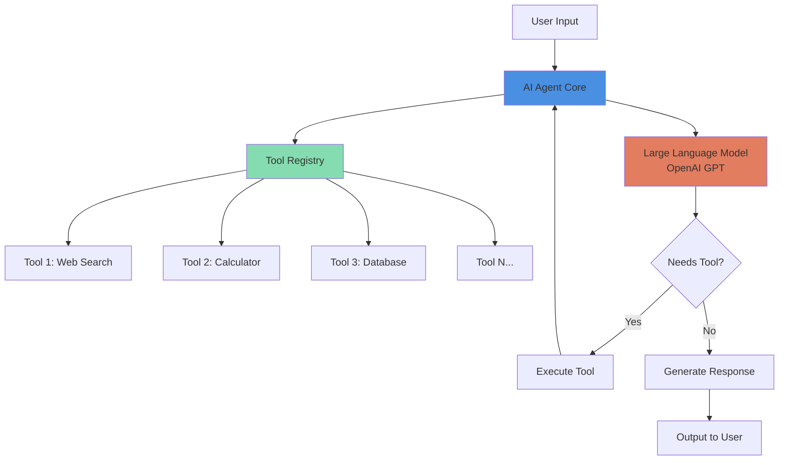

### Core Components
- **User Interface**: Entry point for user requests
- **Agent Core**: Orchestrates the decision-making process
- **LLM (OpenAI GPT)**: Reasoning engine that interprets requests
- **Tool Registry**: Collection of available functions/tools
- **Execution Engine**: Runs selected tools and processes results

---

## 3. Three Key Concepts

### 1️⃣ Tools
- **Definition**: Functions that extend the agent's capabilities
- **Examples**: 
  - Weather API calls
  - Database queries
  - File operations
  - Mathematical calculations
- **Structure**: Each tool has a name, description, and parameter schema
- **Purpose**: Enable the agent to interact with the real world

### 2️⃣ Function Calling
- **What it is**: OpenAI's mechanism for the model to request tool execution
- **How it works**: 
  - Model analyzes user request
  - Determines which function(s) to call
  - Generates structured JSON with function name and arguments
- **Benefits**: Type-safe, structured interaction between LLM and tools

### 3️⃣ Agent Loop
- **Definition**: Iterative process of reasoning, acting, and observing
- **Steps**:
  1. Receive user input
  2. Process with LLM
  3. Decide: respond or use tool
  4. If tool needed: execute and observe result
  5. Repeat until goal achieved
- **Key Point**: Agent continues until no more tools are needed

---

## 4. Agent Loop Sequence

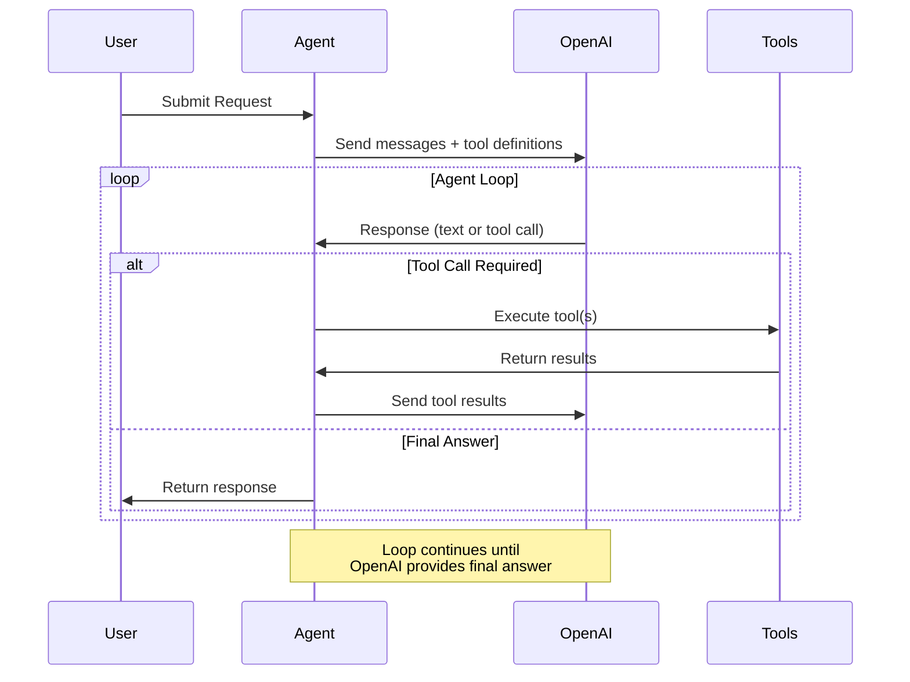

### Sequence Breakdown
1. **Initiation**: User sends a request to the agent
2. **First LLM Call**: Agent forwards request with available tools
3. **Decision Point**: OpenAI decides to call tool or respond
4. **Tool Execution** (if needed): Agent executes requested tool
5. **Result Integration**: Tool results sent back to OpenAI
6. **Loop Continuation**: Process repeats until completion
7. **Final Response**: User receives the answer

---

## 5. Prerequisites

### Required Software
- **Python**: Version 3.8 or higher
- **OpenAI SDK**: `pip install openai`
- **API Key**: OpenAI account with API access
- **Text Editor/IDE**: VS Code, PyCharm, or similar

### Installation Steps
```bash
# Install OpenAI SDK
pip install openai

# Install additional dependencies
pip install python-dotenv  # For environment variables
pip install requests       # For HTTP requests (optional)
```

### Environment Setup
```bash
# Create .env file
echo "OPENAI_API_KEY=your-api-key-here" > .env
```

### Basic Knowledge Required
- Python fundamentals (functions, classes, loops)
- JSON data structures
- Basic understanding of APIs
- Command line familiarity

---

## 6. Step 1: Initialize OpenAI Client

### Code Example
```python
import os
from openai import OpenAI
from dotenv import load_dotenv

# Load environment variables
load_dotenv()

# Initialize client
client = OpenAI(
    api_key=os.getenv("OPENAI_API_KEY")
)
```

### Key Points
- **Security**: Never hardcode API keys in source code
- **Environment Variables**: Use `.env` files for local development
- **Client Instance**: Single client can be reused across requests
- **Error Handling**: Verify API key is loaded correctly

### Verification Test
```python
# Test the connection
try:
    response = client.models.list()
    print("✓ OpenAI client initialized successfully")
except Exception as e:
    print(f"✗ Error: {e}")
```

---

## 7. Step 2: Define Tools/Functions

### Tool Definition Structure
```python
tools = [
    {
        "type": "function",
        "function": {
            "name": "get_weather",
            "description": "Get the current weather for a location",
            "parameters": {
                "type": "object",
                "properties": {
                    "location": {
                        "type": "string",
                        "description": "City name, e.g., San Francisco"
                    },
                    "unit": {
                        "type": "string",
                        "enum": ["celsius", "fahrenheit"],
                        "description": "Temperature unit"
                    }
                },
                "required": ["location"]
            }
        }
    }
]
```

### Best Practices for Tool Definition
- **Clear Names**: Use descriptive, action-oriented names
- **Detailed Descriptions**: Help the model understand when to use the tool
- **Precise Parameters**: Define types, constraints, and requirements
- **Required vs Optional**: Specify which parameters are mandatory
- **Enums for Choices**: Use enums when parameter has fixed options

---

## 8. Step 3: Implement Tool Functions

### Example Implementation
```python
import json
import random

def get_weather(location, unit="fahrenheit"):
    """
    Simulated weather function
    In production, this would call a real weather API
    """
    # Simulate API call
    weather_data = {
        "location": location,
        "temperature": random.randint(60, 85),
        "unit": unit,
        "condition": random.choice(["sunny", "cloudy", "rainy"]),
        "humidity": random.randint(30, 90)
    }
    return json.dumps(weather_data)

def calculate(operation, a, b):
    """
    Perform mathematical operations
    """
    operations = {
        "add": a + b,
        "subtract": a - b,
        "multiply": a * b,
        "divide": a / b if b != 0 else "Error: Division by zero"
    }
    return json.dumps({"result": operations.get(operation, "Invalid operation")})
```

### Implementation Guidelines
- **Return JSON Strings**: Tools should return JSON-formatted strings
- **Error Handling**: Include try-catch blocks for robustness
- **Type Validation**: Validate input parameters before processing
- **Logging**: Add logging for debugging and monitoring

---

## 9. Step 4: Create the Agent Loop

### Core Agent Implementation
```python
def run_agent(user_message):
    messages = [{"role": "user", "content": user_message}]
    
    while True:
        # Call OpenAI with tools
        response = client.chat.completions.create(
            model="gpt-4",
            messages=messages,
            tools=tools,
            tool_choice="auto"
        )
        
        response_message = response.choices[0].message
        messages.append(response_message)
        
        # Check if tool calls are needed
        if not response_message.tool_calls:
            # No more tools needed, return final answer
            return response_message.content
        
        # Execute tool calls
        for tool_call in response_message.tool_calls:
            function_name = tool_call.function.name
            function_args = json.loads(tool_call.function.arguments)
            
            # Call the appropriate function
            if function_name == "get_weather":
                function_response = get_weather(**function_args)
            elif function_name == "calculate":
                function_response = calculate(**function_args)
            
            # Add tool response to messages
            messages.append({
                "tool_call_id": tool_call.id,
                "role": "tool",
                "name": function_name,
                "content": function_response
            })
```

### Loop Mechanics
- **Initialization**: Start with user message
- **Iteration**: Continue until no tool calls returned
- **Message History**: Maintain conversation context
- **Tool Execution**: Dynamically call functions based on LLM decision
- **Response Integration**: Feed tool results back into conversation

---

## 10. Step 5: Execute and Test

### Running Your Agent
```python
# Example usage
if __name__ == "__main__":
    # Test weather query
    result = run_agent("What's the weather in New York?")
    print(f"Agent: {result}")
    
    # Test calculation
    result = run_agent("What is 156 multiplied by 23?")
    print(f"Agent: {result}")
    
    # Test multi-step reasoning
    result = run_agent(
        "Get the weather in Paris and convert the temperature to celsius if it's in fahrenheit"
    )
    print(f"Agent: {result}")
```

### Testing Strategies
- **Unit Tests**: Test individual tools in isolation
- **Integration Tests**: Test full agent loop with various inputs
- **Edge Cases**: Test with missing parameters, invalid inputs
- **Performance Tests**: Monitor response times and token usage

### Expected Outputs
- Agent should correctly identify which tool to use
- Tool results should be integrated into natural language responses
- Multi-step tasks should be completed successfully

---

## 11. Function Calling Flow

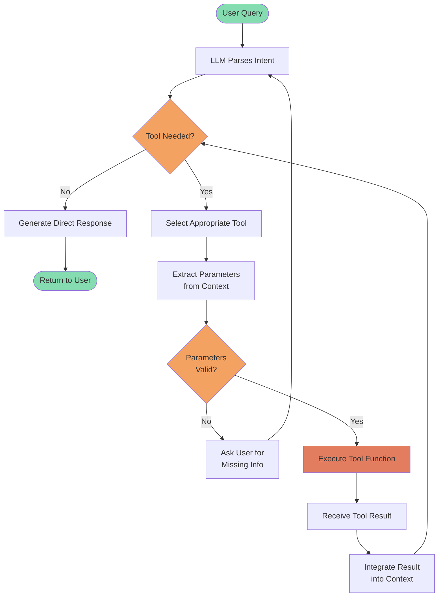

### Flow Explanation
1. **Parse Intent**: LLM understands what the user wants
2. **Decision Making**: Determines if external tools are needed
3. **Tool Selection**: Chooses the most appropriate tool(s)
4. **Parameter Extraction**: Pulls required data from conversation
5. **Validation**: Ensures all required parameters are present
6. **Execution**: Runs the tool and collects results
7. **Integration**: Incorporates results into the response context

---

## 12. System Components Architecture

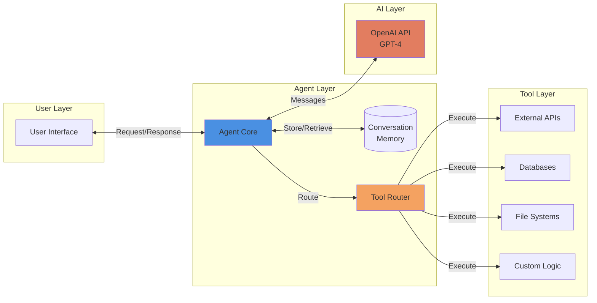

### Component Responsibilities

#### User Layer
- **User Interface**: Web app, CLI, API endpoint, or chat interface

#### Agent Layer
- **Agent Core**: Main orchestration logic
- **Conversation Memory**: Maintains context across interactions
- **Tool Router**: Maps function names to implementations

#### AI Layer
- **OpenAI API**: Language model for reasoning and decision-making

#### Tool Layer
- **External APIs**: Third-party services (weather, news, etc.)
- **Databases**: Data storage and retrieval
- **File Systems**: File operations
- **Custom Logic**: Business-specific functions

---

## 13. Agent State Machine

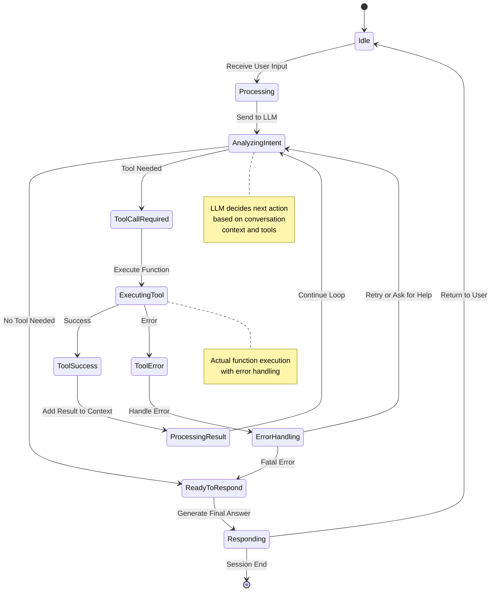

### State Descriptions

- **Idle**: Waiting for user input
- **Processing**: Initial request processing
- **AnalyzingIntent**: LLM determines necessary actions
- **ToolCallRequired**: Tool execution identified
- **ExecutingTool**: Running the selected function
- **ToolSuccess/ToolError**: Tool execution outcomes
- **ProcessingResult**: Integrating tool output
- **ErrorHandling**: Managing failures
- **ReadyToRespond**: Preparing final answer
- **Responding**: Delivering response to user

---

## 14. Real-World Use Cases

### 1. Customer Support Agent
- **Purpose**: Automated customer service
- **Tools**: 
  - Knowledge base search
  - Ticket creation system
  - Order status lookup
  - Refund processing
- **Benefits**: 24/7 availability, instant responses, scalable support

### 2. Data Analysis Assistant
- **Purpose**: Natural language data queries
- **Tools**:
  - SQL database connector
  - Data visualization generator
  - Statistical analysis functions
  - Report generation
- **Benefits**: Non-technical users can query data, faster insights

### 3. Personal Productivity Agent
- **Purpose**: Task automation and scheduling
- **Tools**:
  - Calendar API (Google Calendar, Outlook)
  - Email sender
  - Reminder system
  - Note-taking integration
- **Benefits**: Streamlined workflow, time savings

### 4. E-commerce Shopping Assistant
- **Purpose**: Personalized shopping experience
- **Tools**:
  - Product search
  - Inventory checker
  - Price comparison
  - Cart management
- **Benefits**: Improved customer experience, higher conversion rates

### 5. DevOps Automation Agent
- **Purpose**: Infrastructure management
- **Tools**:
  - Deployment scripts
  - Log analyzer
  - Alert system
  - Resource monitoring
- **Benefits**: Reduced manual work, faster incident response

---

## 15. Best Practices - Tool Design

### 1. Tool Design Principles

#### Clarity
- **Descriptive names**: Use verb-noun pattern (e.g., `get_weather`, `create_ticket`)
- **Clear descriptions**: Explain what the tool does and when to use it
- **Example**: ❌ `process_data()` ✓ `calculate_monthly_revenue()`

#### Granularity
- **Single responsibility**: Each tool should do one thing well
- **Composability**: Small tools can be combined for complex tasks
- **Example**: Separate `search_products()` and `get_product_details()` instead of one large tool

#### Error Handling
```python
def robust_tool(param):
    try:
        # Validate inputs
        if not param:
            return json.dumps({"error": "Missing required parameter"})
        
        # Perform operation
        result = perform_operation(param)
        
        return json.dumps({"success": True, "data": result})
    except Exception as e:
        return json.dumps({"error": str(e), "success": False})
```

### 2. Parameter Design

#### Required vs Optional
- Mark truly required parameters in schema
- Provide sensible defaults for optional parameters
- Document all parameters thoroughly

#### Type Safety
```python
"parameters": {
    "type": "object",
    "properties": {
        "user_id": {
            "type": "integer",
            "description": "Unique user identifier"
        },
        "include_history": {
            "type": "boolean",
            "description": "Include historical data",
            "default": False
        }
    },
    "required": ["user_id"]
}
```

### 3. Performance Considerations
- **Timeout Handling**: Set reasonable timeouts for external calls
- **Caching**: Cache frequently requested data
- **Async Operations**: Use async for I/O-bound operations
- **Rate Limiting**: Respect API rate limits

### 4. Documentation
- **Inline Comments**: Explain complex logic
- **Function Docstrings**: Document purpose, parameters, and return values
- **Examples**: Provide usage examples in documentation

---

## 16. Best Practices - Agent Design

### 1. System Prompt Engineering
```python
system_message = {
    "role": "system",
    "content": """You are a helpful customer support agent.
    
    Guidelines:
    - Always be polite and professional
    - Use tools when you need real-time information
    - If unsure, ask clarifying questions
    - Prioritize user satisfaction
    
    Available tools allow you to:
    - Search our knowledge base
    - Check order status
    - Process refunds (with approval)
    """
}
```

### 2. Context Management
- **Message Trimming**: Limit conversation history to prevent token overflow
- **Summarization**: Summarize old messages when context gets long
- **Relevant Context**: Only include information relevant to current task

### 3. Conversation Flow
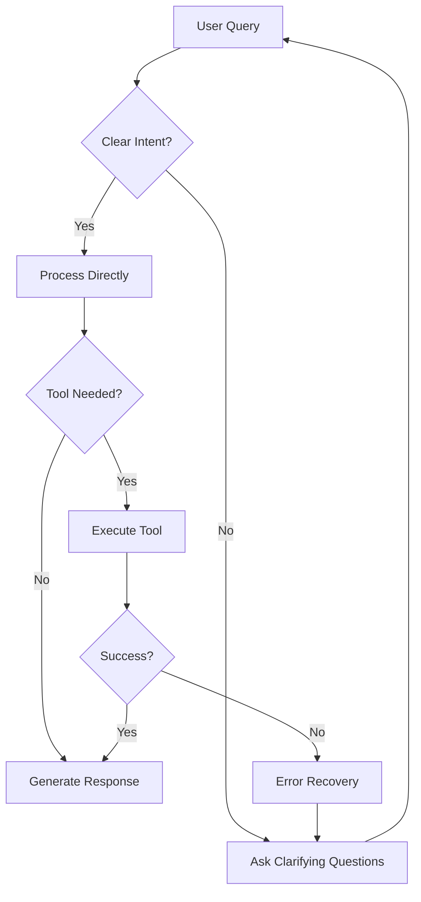

### 4. Safety and Guardrails
- **Input Validation**: Sanitize user inputs
- **Output Filtering**: Screen responses for sensitive data
- **Permission Checks**: Verify user authorization for actions
- **Audit Logging**: Log all tool executions for compliance

---

# Advanced Topics

---

## 17. Memory & Context Management

### Types of Memory

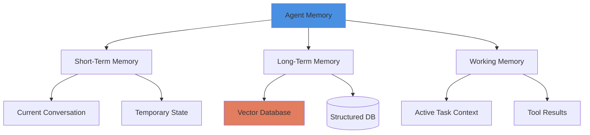

### Vector Databases for Context
- **Purpose**: Store and retrieve relevant information semantically
- **Popular Options**:
  - Pinecone
  - Weaviate
  - Chroma
  - Qdrant

### Implementation Example
```python
from pinecone import Pinecone
from openai import OpenAI

# Initialize vector database
pc = Pinecone(api_key="your-pinecone-key")
index = pc.Index("agent-memory")

def store_memory(text, metadata):
    """Store interaction in vector database"""
    # Generate embedding
    embedding = client.embeddings.create(
        model="text-embedding-ada-002",
        input=text
    ).data[0].embedding
    
    # Store in vector DB
    index.upsert([(metadata["id"], embedding, metadata)])

def retrieve_relevant_context(query, top_k=5):
    """Retrieve relevant past interactions"""
    # Generate query embedding
    query_embedding = client.embeddings.create(
        model="text-embedding-ada-002",
        input=query
    ).data[0].embedding
    
    # Search vector DB
    results = index.query(vector=query_embedding, top_k=top_k)
    return results
```

### Context Window Management
- **Token Counting**: Monitor total tokens in conversation
- **Sliding Window**: Keep only recent N messages
- **Compression**: Summarize older conversations
- **Priority Retention**: Keep important messages (system prompts, key decisions)

---

## 18. Multi-Agent Systems

### Coordination Patterns

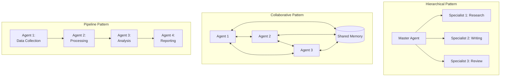

### Hierarchical Pattern
- **Use Case**: Complex tasks with clear subtasks
- **Structure**: Master agent delegates to specialists
- **Example**: Content creation (research → write → edit → publish)
- **Pros**: Clear responsibilities, easier debugging
- **Cons**: Single point of failure (master agent)

### Collaborative Pattern
- **Use Case**: Problems requiring diverse expertise
- **Structure**: Agents communicate peer-to-peer
- **Example**: Brainstorming, consensus building
- **Pros**: Robust, multiple perspectives
- **Cons**: Complex coordination, potential conflicts

### Pipeline Pattern
- **Use Case**: Sequential processing workflows
- **Structure**: Output of one agent feeds into next
- **Example**: Data processing pipeline
- **Pros**: Clear data flow, easy to scale
- **Cons**: Rigid, bottlenecks can form

### Communication Between Agents
```python
class AgentMessage:
    def __init__(self, sender, receiver, content, message_type):
        self.sender = sender
        self.receiver = receiver
        self.content = content
        self.message_type = message_type  # "request", "response", "broadcast"

class AgentCoordinator:
    def __init__(self):
        self.agents = {}
        self.message_queue = []
    
    def register_agent(self, agent_id, agent):
        self.agents[agent_id] = agent
    
    def send_message(self, message):
        if message.message_type == "broadcast":
            for agent in self.agents.values():
                agent.receive_message(message)
        else:
            self.agents[message.receiver].receive_message(message)
```

---

## 19. Error Handling & Reliability

### Error Categories

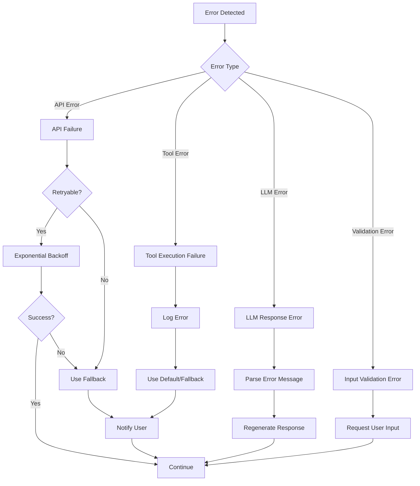

### Retry Logic with Exponential Backoff
```python
import time
from typing import Callable, Any

def retry_with_backoff(
    func: Callable,
    max_retries: int = 3,
    initial_delay: float = 1.0,
    backoff_factor: float = 2.0
) -> Any:
    """
    Retry a function with exponential backoff
    """
    for attempt in range(max_retries):
        try:
            return func()
        except Exception as e:
            if attempt == max_retries - 1:
                raise
            
            delay = initial_delay * (backoff_factor ** attempt)
            print(f"Attempt {attempt + 1} failed: {e}. Retrying in {delay}s...")
            time.sleep(delay)
```

### Graceful Degradation
```python
def robust_agent_call(user_message):
    try:
        # Try primary method
        return run_agent(user_message)
    except OpenAIError as e:
        # API error - try with simpler model
        print(f"Primary model failed: {e}")
        return run_agent_with_fallback_model(user_message)
    except ToolExecutionError as e:
        # Tool error - continue without that tool
        print(f"Tool execution failed: {e}")
        return run_agent_without_tool(user_message)
    except Exception as e:
        # Unknown error - return safe response
        print(f"Unexpected error: {e}")
        return "I'm experiencing technical difficulties. Please try again later."
```

### Monitoring and Alerting
- **Metrics to Track**:
  - Error rates by type
  - Response latency
  - Token usage
  - Tool execution success rate
  - User satisfaction scores

- **Logging Best Practices**:
  ```python
  import logging
  
  logging.basicConfig(level=logging.INFO)
  logger = logging.getLogger(__name__)
  
  def execute_tool(tool_name, args):
      logger.info(f"Executing tool: {tool_name} with args: {args}")
      try:
          result = tools[tool_name](**args)
          logger.info(f"Tool {tool_name} succeeded")
          return result
      except Exception as e:
          logger.error(f"Tool {tool_name} failed: {e}", exc_info=True)
          raise
  ```

---

## 20. Security Considerations

### Authentication & Authorization

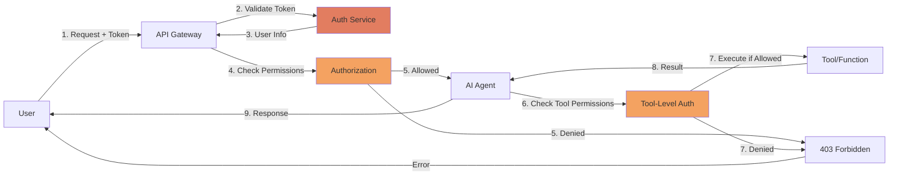

### Authentication Implementation
```python
from functools import wraps
import jwt

def require_auth(f):
    @wraps(f)
    def decorated_function(*args, **kwargs):
        token = request.headers.get('Authorization')
        if not token:
            return {'error': 'No token provided'}, 401
        
        try:
            # Verify JWT token
            payload = jwt.decode(token, SECRET_KEY, algorithms=['HS256'])
            request.user = payload
        except jwt.ExpiredSignatureError:
            return {'error': 'Token expired'}, 401
        except jwt.InvalidTokenError:
            return {'error': 'Invalid token'}, 401
        
        return f(*args, **kwargs)
    return decorated_function
```

### Permission-Based Tool Access
```python
class SecureAgent:
    def __init__(self, user_permissions):
        self.user_permissions = user_permissions
        self.available_tools = self._filter_tools_by_permission()
    
    def _filter_tools_by_permission(self):
        """Only include tools user has permission to use"""
        allowed_tools = []
        for tool in ALL_TOOLS:
            required_permission = tool.get('required_permission')
            if required_permission in self.user_permissions:
                allowed_tools.append(tool)
        return allowed_tools
    
    def execute_tool(self, tool_name, args):
        # Double-check permission before execution
        tool = next((t for t in self.available_tools if t['function']['name'] == tool_name), None)
        if not tool:
            raise PermissionError(f"User not authorized to use {tool_name}")
        
        return self._execute(tool_name, args)
```

### Data Security
- **Input Sanitization**: Validate and sanitize all user inputs
  ```python
  import re
  
  def sanitize_input(user_input):
      # Remove potential SQL injection patterns
      user_input = re.sub(r'[;\'"\\]', '', user_input)
      # Limit length
      user_input = user_input[:1000]
      return user_input
  ```

- **Output Filtering**: Prevent sensitive data leakage
  ```python
  SENSITIVE_PATTERNS = [
      r'\b\d{3}-\d{2}-\d{4}\b',  # SSN
      r'\b\d{16}\b',              # Credit card
      r'\b[\w\.-]+@[\w\.-]+\.\w+\b'  # Email (if needed)
  ]
  
  def filter_sensitive_data(text):
      for pattern in SENSITIVE_PATTERNS:
          text = re.sub(pattern, '[REDACTED]', text)
      return text
  ```

### Prompt Injection Prevention
- **System Message Protection**: Prevent users from overriding system instructions
- **Input Validation**: Check for prompt injection attempts
- **Separate Contexts**: Keep system instructions separate from user input

```python
def detect_prompt_injection(user_input):
    """Basic prompt injection detection"""
    injection_patterns = [
        r'ignore previous instructions',
        r'disregard all',
        r'you are now',
        r'system:',
        r'<\|im_start\|>'
    ]
    
    for pattern in injection_patterns:
        if re.search(pattern, user_input.lower()):
            return True
    return False
```

---

## 21. Performance Optimization

### Token Optimization Strategies

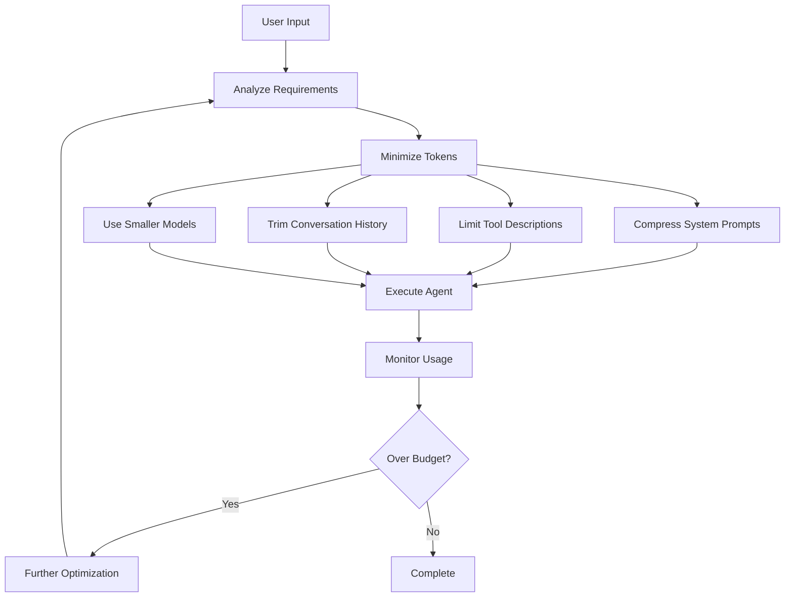

### Token Counting and Budgeting
```python
import tiktoken

def count_tokens(text, model="gpt-4"):
    """Count tokens in text"""
    encoding = tiktoken.encoding_for_model(model)
    return len(encoding.encode(text))

def trim_conversation(messages, max_tokens=4000):
    """Keep conversation within token budget"""
    total_tokens = sum(count_tokens(msg['content']) for msg in messages)
    
    while total_tokens > max_tokens and len(messages) > 1:
        # Remove oldest user/assistant message (keep system message)
        if messages[1]['role'] != 'system':
            removed = messages.pop(1)
            total_tokens -= count_tokens(removed['content'])
    
    return messages
```

### Caching Strategies
```python
from functools import lru_cache
import time

# In-memory cache with TTL
class CacheWithTTL:
    def __init__(self, ttl_seconds=300):
        self.cache = {}
        self.ttl = ttl_seconds
    
    def get(self, key):
        if key in self.cache:
            value, timestamp = self.cache[key]
            if time.time() - timestamp < self.ttl:
                return value
            else:
                del self.cache[key]
        return None
    
    def set(self, key, value):
        self.cache[key] = (value, time.time())

# Usage
tool_cache = CacheWithTTL(ttl_seconds=600)

def cached_tool_execution(tool_name, args):
    cache_key = f"{tool_name}:{str(args)}"
    cached_result = tool_cache.get(cache_key)
    
    if cached_result:
        return cached_result
    
    result = execute_tool(tool_name, args)
    tool_cache.set(cache_key, result)
    return result
```

### Parallel Tool Execution
```python
import asyncio
from concurrent.futures import ThreadPoolExecutor

async def execute_tools_parallel(tool_calls):
    """Execute multiple independent tools in parallel"""
    with ThreadPoolExecutor(max_workers=5) as executor:
        loop = asyncio.get_event_loop()
        tasks = [
            loop.run_in_executor(
                executor,
                execute_tool,
                call.function.name,
                json.loads(call.function.arguments)
            )
            for call in tool_calls
        ]
        results = await asyncio.gather(*tasks)
    return results
```

### Model Selection Strategy
- **Task Complexity Assessment**:
  ```python
  def select_model(task_complexity):
      if task_complexity == "simple":
          return "gpt-3.5-turbo"  # Faster, cheaper
      elif task_complexity == "moderate":
          return "gpt-4"
      else:
          return "gpt-4-turbo"  # Most capable
  
  def assess_complexity(user_input, tools_available):
      # Simple heuristic
      if len(tools_available) > 5:
          return "complex"
      elif any(keyword in user_input.lower() for keyword in ["analyze", "compare", "explain"]):
          return "moderate"
      else:
          return "simple"
  ```

### Response Streaming
```python
def stream_agent_response(user_message):
    """Stream responses for better UX"""
    messages = [{"role": "user", "content": user_message}]
    
    stream = client.chat.completions.create(
        model="gpt-4",
        messages=messages,
        tools=tools,
        stream=True
    )
    
    for chunk in stream:
        if chunk.choices[0].delta.content:
            yield chunk.choices[0].delta.content
```

---

## 22. Testing & Evaluation

### Testing Pyramid for AI Agents

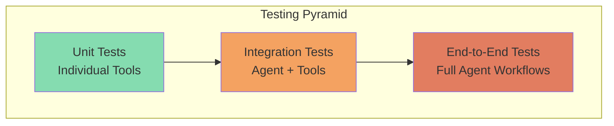

### Unit Testing Tools
```python
import unittest
from unittest.mock import Mock, patch

class TestWeatherTool(unittest.TestCase):
    def test_get_weather_valid_location(self):
        """Test weather tool with valid input"""
        result = get_weather("New York", "fahrenheit")
        data = json.loads(result)
        
        self.assertIn("location", data)
        self.assertEqual(data["location"], "New York")
        self.assertIn("temperature", data)
        self.assertIsInstance(data["temperature"], (int, float))
    
    def test_get_weather_invalid_unit(self):
        """Test weather tool with invalid unit"""
        result = get_weather("Paris", "kelvin")
        data = json.loads(result)
        
        # Should handle gracefully
        self.assertIn("error", data)
    
    @patch('requests.get')
    def test_weather_api_timeout(self, mock_get):
        """Test handling of API timeout"""
        mock_get.side_effect = TimeoutError("API timeout")
        
        result = get_weather("London", "celsius")
        data = json.loads(result)
        
        self.assertIn("error", data)

if __name__ == '__main__':
    unittest.main()
```

### Integration Testing
```python
class TestAgentIntegration(unittest.TestCase):
    def setUp(self):
        """Set up test agent"""
        self.agent = Agent(tools=test_tools)
    
    def test_simple_query_without_tools(self):
        """Test agent handles simple query without tools"""
        response = self.agent.run("What is 2+2?")
        self.assertIn("4", response.lower())
    
    def test_single_tool_call(self):
        """Test agent correctly uses single tool"""
        response = self.agent.run("What's the weather in Boston?")
        self.assertIn("temperature", response.lower())
        self.assertEqual(self.agent.tool_call_count, 1)
    
    def test_multi_tool_call(self):
        """Test agent chains multiple tool calls"""
        response = self.agent.run(
            "Get the weather in Seattle and calculate if I need a jacket (temp < 60F)"
        )
        self.assertGreaterEqual(self.agent.tool_call_count, 2)
```

### Evaluation Metrics

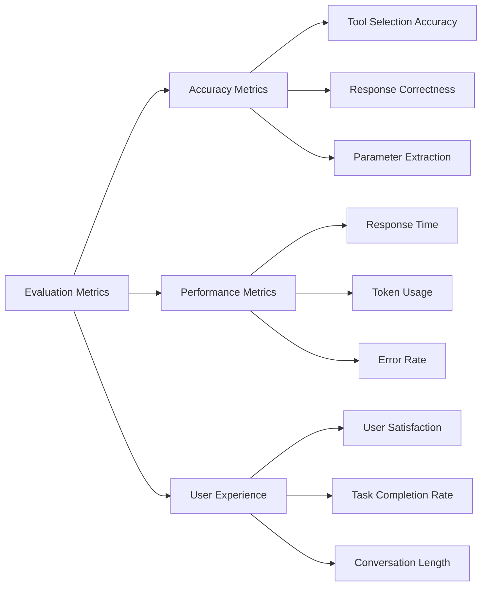

### Automated Evaluation
```python
class AgentEvaluator:
    def __init__(self, test_cases):
        self.test_cases = test_cases
        self.results = []
    
    def evaluate(self, agent):
        """Run evaluation suite"""
        for test_case in self.test_cases:
            result = self._evaluate_single(agent, test_case)
            self.results.append(result)
        
        return self._calculate_metrics()
    
    def _evaluate_single(self, agent, test_case):
        """Evaluate single test case"""
        start_time = time.time()
        response = agent.run(test_case['input'])
        end_time = time.time()
        
        return {
            'input': test_case['input'],
            'expected': test_case['expected'],
            'actual': response,
            'latency': end_time - start_time,
            'correct': self._check_correctness(test_case['expected'], response)
        }
    
    def _calculate_metrics(self):
        """Calculate aggregate metrics"""
        total = len(self.results)
        correct = sum(1 for r in self.results if r['correct'])
        avg_latency = sum(r['latency'] for r in self.results) / total
        
        return {
            'accuracy': correct / total,
            'average_latency': avg_latency,
            'total_tests': total
        }

# Usage
test_cases = [
    {'input': 'What is 5*7?', 'expected': '35'},
    {'input': 'Weather in Miami', 'expected': 'temperature'}
]

evaluator = AgentEvaluator(test_cases)
metrics = evaluator.evaluate(my_agent)
print(f"Accuracy: {metrics['accuracy']:.2%}")
print(f"Avg Latency: {metrics['average_latency']:.2f}s")
```

### A/B Testing Framework
```python
class ABTestingFramework:
    def __init__(self, agent_a, agent_b):
        self.agent_a = agent_a
        self.agent_b = agent_b
        self.results = {'a': [], 'b': []}
    
    def run_test(self, user_query, user_id):
        """Randomly assign user to agent A or B"""
        variant = 'a' if hash(user_id) % 2 == 0 else 'b'
        agent = self.agent_a if variant == 'a' else self.agent_b
        
        start = time.time()
        response = agent.run(user_query)
        latency = time.time() - start
        
        self.results[variant].append({
            'latency': latency,
            'user_id': user_id,
            'timestamp': time.time()
        })
        
        return response, variant
    
    def get_statistics(self):
        """Compare performance between variants"""
        return {
            'a': {
                'count': len(self.results['a']),
                'avg_latency': np.mean([r['latency'] for r in self.results['a']])
            },
            'b': {
                'count': len(self.results['b']),
                'avg_latency': np.mean([r['latency'] for r in self.results['b']])
            }
        }
```

---

## 23. Production Deployment Checklist

### Pre-Deployment

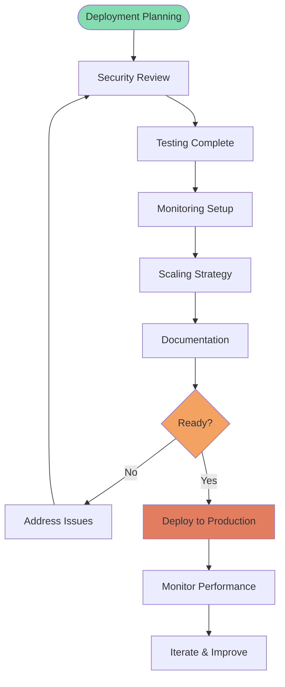

### Security Checklist
- [ ] API keys stored in environment variables or secret management
- [ ] Authentication implemented for all endpoints
- [ ] Authorization checks for tool access
- [ ] Input validation and sanitization
- [ ] Output filtering for sensitive data
- [ ] Rate limiting configured
- [ ] HTTPS/TLS enabled
- [ ] Audit logging enabled

### Performance Checklist
- [ ] Token usage monitored and optimized
- [ ] Response time targets defined and met
- [ ] Caching strategy implemented
- [ ] Database queries optimized
- [ ] Connection pooling configured
- [ ] Load testing completed
- [ ] Auto-scaling configured
- [ ] CDN configured (if applicable)

### Monitoring Checklist
- [ ] Application metrics (latency, throughput)
- [ ] Error tracking and alerting
- [ ] Token usage monitoring
- [ ] Cost tracking per user/request
- [ ] User satisfaction metrics
- [ ] Tool execution success rates
- [ ] Uptime monitoring
- [ ] Log aggregation configured

### Reliability Checklist
- [ ] Error handling for all tool calls
- [ ] Retry logic with exponential backoff
- [ ] Fallback mechanisms in place
- [ ] Circuit breakers for external services
- [ ] Health check endpoints
- [ ] Graceful degradation strategy
- [ ] Backup and recovery plan
- [ ] Incident response plan

### Documentation Checklist
- [ ] API documentation
- [ ] Tool documentation
- [ ] Architecture diagrams
- [ ] Deployment guide
- [ ] Monitoring runbook
- [ ] Incident response procedures
- [ ] User guides
- [ ] Code comments and docstrings

### Deployment Strategy
```python
# Example deployment configuration
deployment_config = {
    "environment": "production",
    "model": "gpt-4",
    "fallback_model": "gpt-3.5-turbo",
    "max_tokens": 4000,
    "temperature": 0.7,
    "timeout": 30,
    "max_retries": 3,
    "rate_limit": {
        "requests_per_minute": 60,
        "tokens_per_minute": 90000
    },
    "monitoring": {
        "log_level": "INFO",
        "metrics_enabled": True,
        "tracing_enabled": True
    },
    "scaling": {
        "min_instances": 2,
        "max_instances": 10,
        "target_cpu_utilization": 70
    }
}
```

---

## Conclusion & Next Steps

### Key Takeaways
1. **AI Agents are powerful**: They extend LLMs with tools and enable real-world interactions
2. **Architecture matters**: Well-designed tools and loops are critical for success
3. **Production requires rigor**: Security, performance, and reliability are essential
4. **Iterate and improve**: Start simple, measure, and enhance based on feedback

### Learning Path
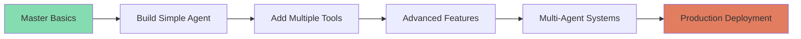

### Resources
- **Official Documentation**: [OpenAI Function Calling](https://platform.openai.com/docs/guides/function-calling)
- **GitHub Examples**: Search for "openai function calling examples"
- **Community**: OpenAI Developer Forum, Discord communities
- **Courses**: DeepLearning.AI, Coursera AI courses

### Practice Projects
1. **Personal Assistant**: Calendar, email, reminders
2. **Customer Support Bot**: Knowledge base + ticket system
3. **Data Analysis Agent**: SQL queries + visualization
4. **DevOps Helper**: Deployment + monitoring + alerts
5. **E-commerce Agent**: Product search + recommendations

### Contact & Questions
- **Presenter**: [Your Name]
- **Email**: [your-email@example.com]
- **GitHub**: [github.com/yourusername]
- **LinkedIn**: [linkedin.com/in/yourprofile]

---

## Thank You!

**Questions?**

---

## Appendix: Additional Code Examples

### Complete Agent Example
```python
import os
import json
from openai import OpenAI
from dotenv import load_dotenv

# Load environment
load_dotenv()
client = OpenAI(api_key=os.getenv("OPENAI_API_KEY"))

# Define tools
tools = [
    {
        "type": "function",
        "function": {
            "name": "get_weather",
            "description": "Get current weather for a location",
            "parameters": {
                "type": "object",
                "properties": {
                    "location": {
                        "type": "string",
                        "description": "City name"
                    },
                    "unit": {
                        "type": "string",
                        "enum": ["celsius", "fahrenheit"]
                    }
                },
                "required": ["location"]
            }
        }
    },
    {
        "type": "function",
        "function": {
            "name": "calculate",
            "description": "Perform mathematical calculations",
            "parameters": {
                "type": "object",
                "properties": {
                    "operation": {
                        "type": "string",
                        "enum": ["add", "subtract", "multiply", "divide"]
                    },
                    "a": {"type": "number"},
                    "b": {"type": "number"}
                },
                "required": ["operation", "a", "b"]
            }
        }
    }
]

# Implement tool functions
def get_weather(location, unit="fahrenheit"):
    # Simulated weather data
    import random
    return json.dumps({
        "location": location,
        "temperature": random.randint(50, 90),
        "unit": unit,
        "condition": random.choice(["sunny", "cloudy", "rainy"])
    })

def calculate(operation, a, b):
    ops = {
        "add": a + b,
        "subtract": a - b,
        "multiply": a * b,
        "divide": a / b if b != 0 else "Error"
    }
    return json.dumps({"result": ops.get(operation)})

# Agent function
def run_agent(user_message):
    messages = [{"role": "user", "content": user_message}]
    
    print(f"\n🤖 User: {user_message}")
    
    while True:
        response = client.chat.completions.create(
            model="gpt-4",
            messages=messages,
            tools=tools,
            tool_choice="auto"
        )
        
        response_message = response.choices[0].message
        messages.append(response_message)
        
        if not response_message.tool_calls:
            print(f"🤖 Agent: {response_message.content}")
            return response_message.content
        
        # Execute tools
        for tool_call in response_message.tool_calls:
            function_name = tool_call.function.name
            function_args = json.loads(tool_call.function.arguments)
            
            print(f"🔧 Calling tool: {function_name}({function_args})")
            
            if function_name == "get_weather":
                function_response = get_weather(**function_args)
            elif function_name == "calculate":
                function_response = calculate(**function_args)
            
            messages.append({
                "tool_call_id": tool_call.id,
                "role": "tool",
                "name": function_name,
                "content": function_response
            })

# Test the agent
if __name__ == "__main__":
    run_agent("What's the weather in Tokyo?")
    run_agent("Calculate 15 * 23")
    run_agent("Get weather in Paris and tell me if I need a jacket (under 60F)")
```

---

## Appendix: Glossary

- **Agent**: Autonomous AI system that can use tools and make decisions
- **Tool/Function**: External capability the agent can invoke
- **Function Calling**: OpenAI's mechanism for structured tool invocation
- **Agent Loop**: Iterative process of reasoning and acting
- **Context Window**: Maximum amount of text (in tokens) the model can process
- **Token**: Unit of text (roughly 4 characters) used for pricing and limits
- **System Prompt**: Initial instructions that define agent behavior
- **Embedding**: Numerical representation of text for semantic search
- **Vector Database**: Storage system for embeddings enabling semantic search
- **RAG**: Retrieval-Augmented Generation - using external knowledge
- **Multi-Agent System**: Multiple agents working together
- **Prompt Injection**: Security attack trying to override agent instructions
